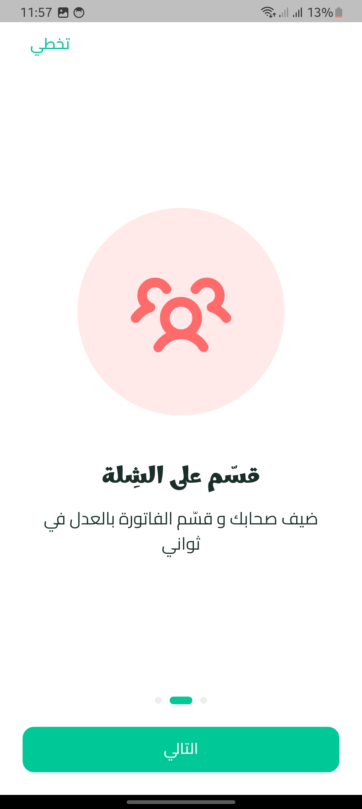
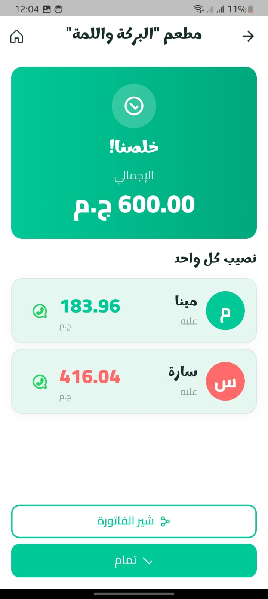
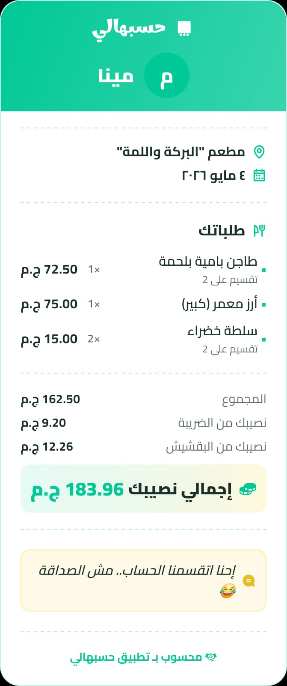
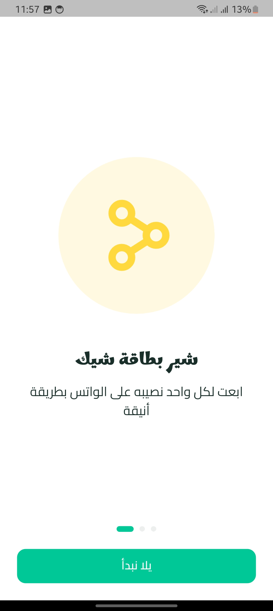
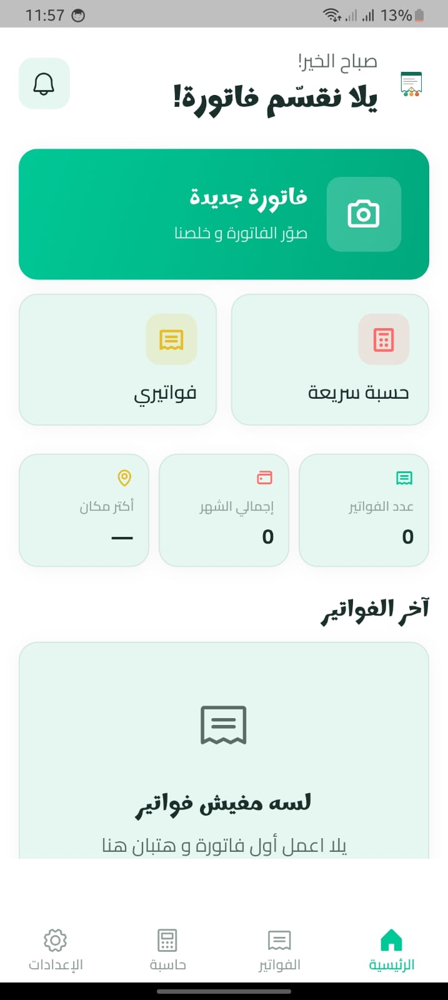
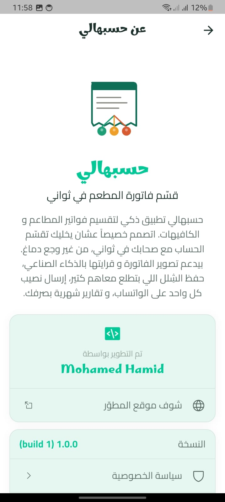

<div align="center">

# 🧮 Hsbhali · حسبهالي

### Smart Bill Splitter with AI · تطبيق ذكي لتقسيم الفواتير

[](https://flutter.dev)
[](https://www.android.com)
[](#)
[](#)

**[🇬🇧 English](#-english)** · **[🇸🇦 العربي](#-عن-التطبيق)**

</div>

---

## 🇬🇧 English

### About

**Hsbhali** is a smart Flutter mobile app that helps you split restaurant and café bills with friends in seconds — no headaches, no math. Powered by **Google Gemini AI**, the app reads your receipt photos automatically, extracts items and prices, and generates fair splits for everyone.

Designed specifically for Arabic-speaking users with a warm Egyptian dialect throughout the entire experience.

### Key Features

- 🤖 **AI Receipt Reading** — Snap a photo and let Gemini AI extract items automatically
- 🎯 **Flexible Splitting** — Split equally or by quantity (e.g., who had how many burgers)
- 👥 **Saved Groups** — Save your favorite groups (work, family, friends) with smart suggestions
- 📤 **Pro Sharing** — Share via WhatsApp/Telegram with a beautifully designed receipt image
- 📊 **Monthly Reports** — Track your spending with interactive charts
- 🌙 **Dark Mode** — Light, dark, or follow system theme
- 🔒 **Local Storage Only** — All data stays on your device, nothing sent to servers
- 🌍 **Egyptian Arabic** — Warm, friendly tone throughout the app

### Tech Stack

`Flutter` · `Dart` · `Riverpod` · `Hive` · `Gemini AI 2.5 Flash` · `Firebase` · `Go Router` · `AdMob` · `Clean Architecture + MVVM`

### Screenshots

<div align="center">
  
  
  
</div>

> 📖 **Full documentation in Arabic below** — [Jump to Arabic section](#-عن-التطبيق)

### Connect with Developer

<div align="center">

[](https://www.linkedin.com/in/mohamed-hamid-3bb3aa243/)
[](https://mohamedhamid4.github.io/MohamedHamid.com/)
[](mailto:mohamedhamidofficial4@gmail.com)

</div>

---

<br>

# 🇸🇦 النسخة العربية

## 📖 عن التطبيق

**حسبهالي** تطبيق ذكي مصمم خصيصاً للمستخدم العربي عشان يخلّيك تقسّم فاتورة المطعم مع أصحابك بدون أي وجع دماغ. التطبيق بيستخدم **الذكاء الاصطناعي** لقراءة فاتورة المطعم تلقائياً، بيحفظ شِلَلك المفضّلة، وبيطلعلك تقسيم عادل لكل واحد بالضبط — بلهجة مصرية ودودة وتجربة مستخدم مريحة.

> **"يلا نقسّم فاتورة!"** — أول شيء بيستقبلك التطبيق فيه 💚

---

## ✨ الميزات

### 🤖 ذكاء اصطناعي يقرأ الفاتورة
- صوّر الفاتورة وخلّي **Gemini AI** يستخرج الأصناف والأسعار تلقائياً
- يدعم الفواتير العربية والإنجليزية
- في حالة فشل القراءة، التطبيق يعرض شاشة "إدخال يدوي" بسلاسة

### 🎯 تقسيم مرن وذكي
خيارات تقسيم متعددة لكل صنف:
- **نص و نص**: تقسيم عادل بين المختارين
- **بالكمية**: تحديد عدد القطع لكل شخص (مثلاً: محمد أخد 2 برجر، أحمد أخد 1)

### 👥 إدارة الشِلَل المحفوظة
- احفظ شلّتك المفضّلة (الشغل، العيلة، الأصحاب)
- اقتراحات ذكية حسب الوقت (شلّة الشغل في أيام الأسبوع، شلّة العيلة في الويكند)

### 📤 مشاركة احترافية
- شارك التقسيم على **واتساب** أو **تيليجرام** بضغطة زر
- إرسال نصيب كل شخص على رقمه مباشرةً
- احفظ الفاتورة كصورة مصممة في معرض الصور

### 📊 تقارير شهرية وإحصائيات
- تابع مصاريفك الشهرية
- شوف أكتر مكان بتروحه
- رسوم بيانية تفاعلية باستخدام `fl_chart`

### 🌍 دعم كامل للعربية
- لهجة مصرية أصيلة في كل النصوص
- دعم RTL كامل
- خط **Marhey** للعناوين + **Cairo** للنصوص

### 🌙 وضع ليلي مريح
- ثيم فاتح/داكن/حسب النظام
- تصميم بصري مريح للعين

### 💰 حاسبة سريعة
- احسب الفاتورة بدون حفظ
- أضف بقشيش بنسب جاهزة (10%, 15%, 20%)
- نصيب كل واحد فوراً

### 🔒 خصوصية كاملة
- كل البيانات على جهازك بس
- لا يُرسل أي شيء لخوادم خارجية (عدا تحليل صورة الفاتورة بـ AI)
- 💾 **Local Storage Only** — بياناتك على جهازك بس، مفيش سيرفر بيخزّن حاجة

---

## 📸 من داخل التطبيق

<div align="center">

### 🏠 الشاشة الرئيسية
*"يلا نقسّم فاتورة!" — تصميم مريح بألوان طبيعية*


</div>

---

<div align="center">

### 💸 نصيب كل واحد
*التقسيم النهائي بشكل واضح وأنيق — يوضّح نصيب كل شخص بالضبط*


</div>

---

<div align="center">

### 🧾 الفاتورة المشتركة
*صورة مصممة احترافياً جاهزة للمشاركة على واتساب — مع جمل ظريفة عشوائية بلهجة مصرية*


</div>

---

<div align="center">

### 🧮 الحسبة السريعة
*احسب الفاتورة بسرعة بدون حفظ — مع البقشيش الاختياري*



</div>

---

<div align="center">

### 📂 الفواتير المحفوظة
*كل فواتيرك السابقة في مكان واحد*



</div>

---

<div align="center">

### ⚙️ الإعدادات
*تحكّم كامل في الثيم، اللغة، العملة، والشِلَل*



</div>

---

## 🎬 فيديو توضيحي

> 🎥 *سيتم إضافة فيديو توضيحي للتطبيق قريباً*

<!-- بعد ما تنزّل الفيديو على يوتيوب، استخدم هذا الكود
<div align="center">
  <a href="https://www.youtube.com/watch?v=YOUR_VIDEO_ID">
    
  </a>
</div>
-->

---

## 🛠️ التقنيات المستخدمة

### Frontend
- **Flutter 3.x** — إطار عمل تطوير الموبايل
- **Dart** — لغة البرمجة
- **Riverpod** — إدارة الحالة (State Management)
- **Go Router** — التنقل بين الشاشات
- **Google Fonts** — خطوط Marhey + Cairo

### الذكاء الاصطناعي
- **Google Gemini 2.5 Flash** — قراءة وتحليل الفواتير
- استخراج JSON منظم من الصور

### قاعدة البيانات والتخزين
- **Hive** — قاعدة بيانات NoSQL محلية وسريعة
- **SharedPreferences** — تخزين الإعدادات
- **File System** — حفظ صور الفواتير

### الخدمات السحابية
- **Firebase Analytics** — تحليلات الاستخدام
- **Firebase Crashlytics** — تتبع الأعطال
- **Google AdMob** — الإعلانات (Banner, Interstitial, Rewarded)

### التصميم
- **Phosphor Icons** — أيقونات حديثة
- **fl_chart** — رسوم بيانية تفاعلية
- **flutter_native_splash** — شاشة البداية الأصلية
- **flutter_launcher_icons** — أيقونات التطبيق

### المعالجة والمشاركة
- **image_picker** — التقاط الصور
- **flutter_image_compress** — ضغط الصور
- **share_plus** — المشاركة الخارجية
- **gal** — حفظ الصور في المعرض

---

## 🏗️ البنية المعمارية

التطبيق مبني على نمط **Clean Architecture** مع **MVVM**:

```
lib/
├── core/                       # الأساسيات والخدمات المشتركة
│   ├── constants/              # الثوابت (ألوان، خطوط، أبعاد)
│   ├── services/               # الخدمات (Gemini, AdMob, Analytics)
│   ├── theme/                  # الثيم الفاتح/الداكن
│   └── router/                 # تعريفات التنقل
│
├── features/                   # الميزات الرئيسية
│   ├── bills/                  # الفواتير
│   │   ├── data/               # قاعدة البيانات والـ Repositories
│   │   ├── domain/             # المنطق التجاري (Use Cases)
│   │   └── presentation/       # الواجهات (Screens, Widgets, ViewModels)
│   ├── shillas/                # الشِلَل المحفوظة
│   ├── people/                 # إدارة الأشخاص
│   ├── splash/                 # شاشة البداية
│   ├── onboarding/             # الإعداد الأولي
│   ├── settings/               # الإعدادات
│   ├── insights/               # الإحصائيات والتقارير
│   └── about/                  # عن التطبيق
│
├── l10n/                       # الترجمات (عربي/إنجليزي)
├── shared/                     # المكونات المشتركة
│   └── widgets/                # Widgets قابلة لإعادة الاستخدام
│
└── main.dart                   # نقطة البداية
```

### النمط المعماري

```
┌─────────────────────────────────┐
│      Presentation Layer         │  ← Screens, Widgets, ViewModels
├─────────────────────────────────┤
│        Domain Layer             │  ← Use Cases, Entities
├─────────────────────────────────┤
│         Data Layer              │  ← Repositories, Data Sources
├─────────────────────────────────┤
│   Hive · SharedPreferences      │  ← Local Storage
│   Gemini · Firebase · AdMob     │  ← External Services
└─────────────────────────────────┘
```

---

## 🚀 كيف تشغّله محلياً

### المتطلبات

- **Flutter SDK** 3.x أو أحدث
- **Dart** 3.x
- **Android Studio** أو **VS Code**
- **JDK** 17 أو أحدث
- **Android SDK** 34 أو أحدث

### الخطوات

1. **استنسخ الريبو**:
   ```bash
   git clone https://github.com/MohamedHamid4/hsbhali_app.git
   cd hsbhali_app
   ```

2. **ثبّت المكتبات**:
   ```bash
   flutter pub get
   ```

3. **أضف ملف Firebase الخاص بك**:
   - حمّل `google-services.json` من Firebase Console
   - ضعه في `android/app/google-services.json`

4. **أضف API Key لـ Gemini**:
   - أنشئ ملف `lib/core/constants/api_keys.dart`
   - أضف:
     ```dart
     class ApiKeys {
       static const String geminiApiKey = 'YOUR_GEMINI_API_KEY';
     }
     ```

5. **شغّل التطبيق**:
   ```bash
   flutter run
   ```

### بناء APK للإنتاج

```bash
# Debug APK
flutter build apk --debug

# Release App Bundle (للنشر على Play Store)
flutter build appbundle --release
```

---

## 🧪 الاختبارات

التطبيق يحتوي على **8 اختبارات وحدة** تغطي:
- ✅ Bills CRUD operations
- ✅ Calculate Split (Equal mode)
- ✅ Calculate Split (Quantity mode)
- ✅ Tax/tip distribution
- ✅ Multi-bill statistics

```bash
flutter test
```

---

## 📈 خارطة الطريق

### النسخة الحالية (v1.0.0)
- ✅ تقسيم فواتير ذكي
- ✅ AI لقراءة الفواتير
- ✅ شِلَل محفوظة
- ✅ مشاركة احترافية
- ✅ إحصائيات شهرية

### النسخ القادمة
- 🔜 **v1.1**: نسخ احتياطي على Google Drive
- 🔜 **v1.2**: مزامنة بين الأجهزة
- 🔜 **v1.3**: نسخة iOS
- 🔜 **v1.4**: مشاركة فاتورة بـ QR Code
- 🔜 **v1.5**: تكامل مع البنوك للسداد المباشر

---

## 👨‍💻 المطوّر

<div align="center">

### Mohamed Hamid
**Flutter & Mobile App Developer** 📱

Software Developer من فلسطين 🇵🇸، شغوف بتطوير تطبيقات الموبايل اللي تحل مشاكل حقيقية للمستخدمين العرب. التركيز على Clean Architecture، تجربة المستخدم، والذكاء الاصطناعي.

<br>

[](https://www.linkedin.com/in/mohamed-hamid-3bb3aa243/)
[](https://mohamedhamid4.github.io/MohamedHamid.com/)
[](https://github.com/MohamedHamid4)
[](mailto:mohamedhamidofficial4@gmail.com)

<br>

### 🌐 تواصل معي

| الوسيلة | الرابط |
|---------|--------|
| 💼 **LinkedIn** | [linkedin.com/in/mohamed-hamid-3bb3aa243](https://www.linkedin.com/in/mohamed-hamid-3bb3aa243/) |
| 🌐 **Portfolio** | [mohamedhamid4.github.io/MohamedHamid.com](https://mohamedhamid4.github.io/MohamedHamid.com/) |
| 💻 **GitHub** | [github.com/MohamedHamid4](https://github.com/MohamedHamid4) |
| 📧 **Email** | [mohamedhamidofficial4@gmail.com](mailto:mohamedhamidofficial4@gmail.com) |

<br>

**تم تطوير التطبيق بحب من فلسطين 🇵🇸**

</div>

---

## 📜 الترخيص

هذا التطبيق ملكية خاصة لـ **Mohamed Hamid**. جميع الحقوق محفوظة © 2026.

غير مسموح بإعادة الإنتاج أو التوزيع أو التعديل بدون إذن خطّي مسبق.

---

## 🤝 الإبلاغ عن مشكلة أو اقتراح

لو واجهت أي مشكلة أو عندك اقتراح:

- 📧 **إيميل مباشر**: [mohamedhamidofficial4@gmail.com](mailto:mohamedhamidofficial4@gmail.com)
- 💼 **LinkedIn**: [Mohamed Hamid](https://www.linkedin.com/in/mohamed-hamid-3bb3aa243/)
- 🐛 **GitHub Issues**: [افتح Issue جديد](https://github.com/MohamedHamid4/hsbhali_app/issues)

---

<div align="center">

### إذا أعجبك المشروع، أعطه ⭐!

**Made with 💚 in Palestine 🇵🇸**

<br>

[](https://www.linkedin.com/in/mohamed-hamid-3bb3aa243/)
[](https://mohamedhamid4.github.io/MohamedHamid.com/)

</div>
